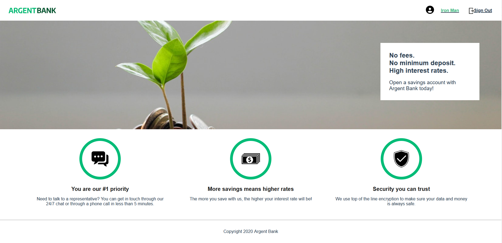
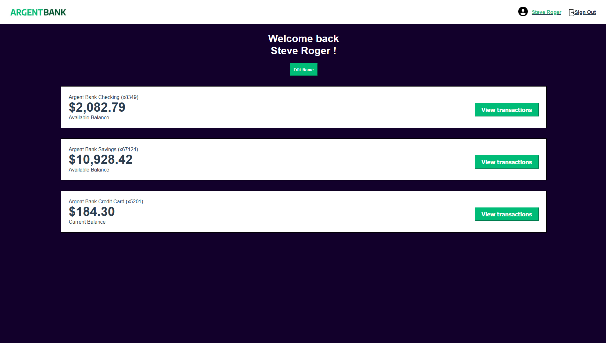
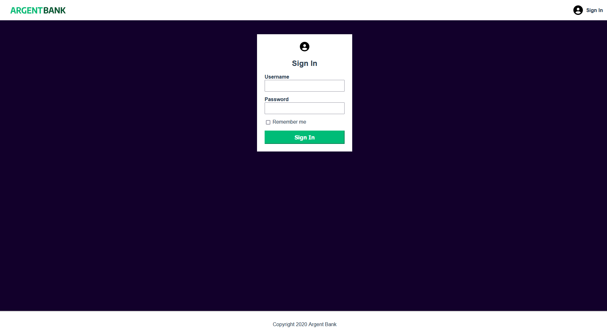

# ArgentBank 🇬🇧

**Personnal bank account manager**

<kbd></kbd>

<kbd></kbd>

<kbd></kbd>

> Issue

Use an API for a banking application

> Needs

- Authentication: secure access to the service to manage your bank account and user profile.
- Transactions API: backend framework template for this feature.

## Skills developed

- [x] Implement a state manager in a React `REDUX` application
- [x] Interact with an `AXIOS API | MONGOdb`
- [x] Implement an authentication system to a secure API `JWT token`
- [x] Modeling a `SWAGGER API | NODEjs`

## Resources Provided

* [API](https://github.com/OpenClassrooms-Student-Center/Project-10-Bank-API)
* [API documentation](http://localhost:3001/api-docs/)
* [Issues](https://github.com/OpenClassrooms-Student-Center/Project-10-Bank-API/tree/master/.github/ISSUE_TEMPLATE)
* [Maquettes](https://github.com/AndyRama/AndyRamaroson_13_25112021/tree/master/FrontEnd/designs/wireframes)
* [more details - Product](https://github.com/AndyRama/AndyRamaroson_13_25112021/blob/master/README.md)

## Libraries

    REACT

## Install

### Recommended editor

* [Visual Studio code](https://code.visualstudio.com/)

### Requirements

* [Git](https://git-scm.com/) to clone repos
* [nodeJS](https://nodejs.org/fr/)(version 14.20.1) to execute commands
* [npm](https://www.npmjs.com/) (version 6.14.17) to launch the application (front-end & back-end)

### Dependencies

*  [react-router-dom](https://reactrouter.com/web/guides/quick-start) (version 6.4.3)
*  [Redux](https://redux.js.org/introduction/getting-started) (version 4.2.0)
*  [react-redux](https://react-redux.js.org/introduction/getting-started) (version 8.0.5)
*  [redux/toolkit](https://redux-toolkit.js.org/introduction/getting-started) (version 2.13.9)
*  [redux-thunk](https://redux.js.org/usage/writing-logic-thunks) (version 8.0.5)
*  [axios](https://www.npmjs.com/package/axios) (version 1.2.0)
*  [prop-types](https://www.npmjs.com/package/prop-types) (version 15.7.2)

### Step 1: Launching the back-end

- Clone the project repo: `gh repo clone AndyRama/AndyRamaroson_13_25112021`
- Go to this folder: `cd BackEnd/server`
- Install its dependencies: `npm install`
- Launch back-end on default port: `npm run dev:server`
- Populate the database (default): `npm run populate-db`

### Step 2: Launching the front-end

- Go to this folder: `cd FrontEnd/argentbank`
- Install its dependencies: `npm install`
- Launch front-end on port 3000: `npm run start`

```bash
Web Render View URL: http://localhost:3000
ArgentBank API provides data for users 2 users.
```

--------------------------------------------------

# SportSee 🇫🇷

> PROBLEMATIQUE

Utilisez une API pour une application bancaire

> BESOINS

- Authentification : accès sécurisé au service pour gérer son compte bancaire et son profil utilisateur
- API Transactions : modèle de structure backend pour cette fonctionnalité

## Compétences développées

- [x] Implémenter un gestionnaire d'état dans une application React `REDUX`
- [x] Interagir avec une API `AXIOS | MONGOdb`
- [x] Implémenter un système d'authentification à une API sécurisée `JWT token`
- [x] Modéliser une API `SWAGGER | NODEjs`

## Ressources fournies

* [API](https://github.com/OpenClassrooms-Student-Center/Project-10-Bank-API)
* [API documentation](http://localhost:3001/api-docs/)
* [Issues](https://github.com/OpenClassrooms-Student-Center/Project-10-Bank-API/tree/master/.github/ISSUE_TEMPLATE)
* [Maquettes](https://github.com/AndyRama/AndyRamaroson_13_25112021/tree/master/FrontEnd/designs/wireframes)
* [plus de details - Product](https://github.com/AndyRama/AndyRamaroson_13_25112021/blob/master/README.md)

## Bibliothèques

    REACT

## Installation

### Editeur recommandé

* [Visual Studio code](https://code.visualstudio.com/)

### Prérequis

* [Git] pour cloner les repos.
* [nodeJS](version 14.20.1) pour exécuter les commandes.
* [npm](version 6.14.17) pour lancer l'application (back-end & front-end).

### Dépendances

*  [react-router-dom](https://reactrouter.com/web/guides/quick-start) (version 6.4.3)
*  [Redux](https://redux.js.org/introduction/getting-started) (version 4.2.0)
*  [react-redux](https://react-redux.js.org/introduction/getting-started) (version 8.0.5)
*  [redux/toolkit](https://redux-toolkit.js.org/introduction/getting-started) (version 2.13.9)
*  [redux-thunk](https://redux.js.org/usage/writing-logic-thunks) (version 8.0.5)
*  [axios](https://www.npmjs.com/package/axios) (version 1.2.0)
*  [prop-types](https://www.npmjs.com/package/prop-types) (version 15.7.2)

### Etape 1 : Lancement du back-end 

- Cloner le repo du projet : `gh repo clone AndyRama/AndyRamaroson_13_25112021`
- Aller dans ce dossier : `cd BackEnd/server`
- Installer ses dépendances : `npm install`
- Lancer le backEnd sur le port par défaut : `npm run dev:server`
- Peupler la base de donnée (par défaut) : `npm run populate-db`

### Etape 2 : Lancement du front-end 

- Aller dans ce dossier : `cd FrontEnd/argentbank `
- Installer ses dépendances : `npm install`
- Lancer le frontEnd sur le port 3000 : `npm run start`

```bash
URL de la vue de rendu Web : http://localhost:3000
API de ArgentBank fournit des données pour les utilisateurs 2 utilisateurs.
```
